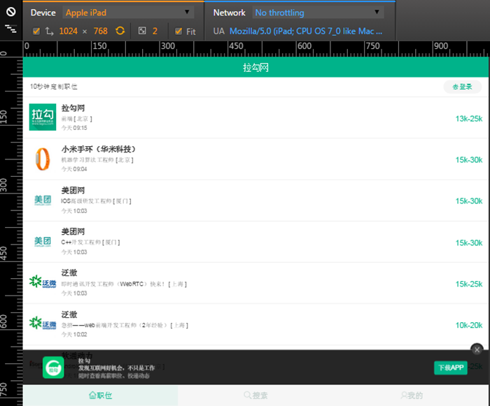

屏幕适配没有银弹，不同方案有不同利弊。

不同人、不同场景对于更大的屏幕有不同的需求，总的分为两种：更多或更大。

## 更多

大屏幕带来了较大的显示空间。但是，无论是留边的，还是等比缩放的方式，在屏幕加大时并不能将更多的信息呈现给用户。白白浪费了大屏幕的优势。

应对这个问题，有三条基础原则：文字流式，控件弹性，图片等比缩放。

典型弹性布局：




### 文字流式


屏幕变大时，保持文字大小不变，随着屏幕变大，横向拉宽文字的显示区域。

为了良好的阅读的体验，字体大小不应该无限制变化。字体大小在合理范围内，才能保证阅读体验。

### 控件弹性（flexible）


屏幕变大时，保持控件大小不变，随着屏幕的变大，横向调整控件的相对位置。

相比于将控件固定在某个位置上，这种布局能更好地保持控件在页面上的平衡。同时，也能保证屏幕变大的时候，控件不会因为被拉大而失真。

### 图片等比缩放


对于图片，屏幕变大时，没办法只拉伸横向的，这样会导致图片的比例失调。所以，对于图片，要保证等比放大。也就是说，在宽度跟随屏幕变大的时候，高度也等比地变大。如果图片允许部分裁剪，则可以考虑不等比缩放。

## 更大

这个方案成本最低。

所有尺寸都用 `rem`、`rpx`、`vw` 设置，即所有元素都进行等比缩放。这个方案，在仅应用在手机竖屏上时尤其好用，只要照着设计稿开发完，所有手机设备上的显示效果都大差不差。


## DRAFT

小程序的方案是提供 `rpx` 用作等比缩放——`设计稿 1px / 设计稿基准宽度 = 框架样式 1rpx / 750rpx` ，这个方案很粗暴、很好用，在手机尺寸繁多的情况下，`rpx` 能保证界面基本一模样，完全无需多动脑筋，页面布局啥的一把梭就结了。**缺点**也很明显，屏幕不能宽——不能横屏，一宽东西就变的特别大。

`rem` 根据根节点字体大小变化尺寸，一般的有几种设置字体大小的方案，原则上都是为了方便计算

1. 是获取 `document.documentElement.clientWidth` 后分割成20份（任一个方便计算的份数）后其中一份的大小设置成根节点字体大小。
2. `media query` 直接的根据屏幕尺寸设置大小
3. 根据设计稿尺寸把根节点字体大小处理成 `100px`。比如设计稿是750的，那要处理成`100px`就是 `屏幕宽度/7.5` 即可。如果设计稿是1080的，那就用 `屏幕宽度/10.8`。在开发的过程中，比如碰到一个120px\*40px的元素，那就可以写成1.2rem\*0.4rem。

```js
// 如果用户在PC端浏览，页面过宽怎么办？一般我们都会设置一个最大宽度，大于这个宽度的话页面居中，两边留白
var clientWidth = document.documentElement.clientWidth;
clientWidth = clientWidth < 780 ? clientWidth : 780;
document.documentElement.style.fontSize = clientWidth / 100 + 'px';
```


> [iPhone屏幕分辨率和适配规则（规则篇）](https://www.jianshu.com/p/1b24ca5e8c12)
>
> [Rem布局的原理解析-颜海镜](https://yanhaijing.com/css/2017/09/29/principle-of-rem-layout/)

uni-app 作为跨端开发的框架，对不同屏幕尺寸的适配是有方案的。

> [uni-app 屏幕适配指南——包括横屏情况下的适配方案](https://uniapp.dcloud.io/adapt) 和 [uni-app 页面样式与布局](https://uniapp.dcloud.io/frame?id=%e9%a1%b5%e9%9d%a2%e6%a0%b7%e5%bc%8f%e4%b8%8e%e5%b8%83%e5%b1%80)

